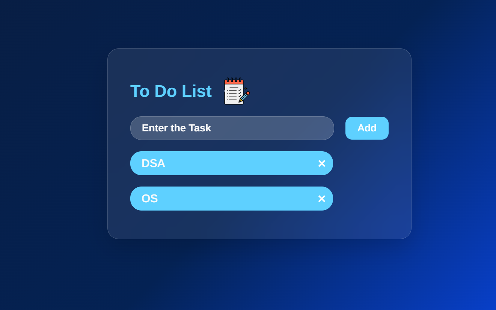

# 📝 To-Do List Web Application

A modern and responsive To-Do List application built using **HTML, CSS, and JavaScript**. This project helps users organize daily tasks efficiently with a clean user interface and an interactive user experience.

## 🚀 Live Demo

🔗 Live Website: https://to-do-list-7-orcin.vercel.app/

## ✨ Features

* ➕ Add new tasks
* ❌ Delete tasks instantly
* 📱 Responsive design
* 🎨 Modern Gradient and Glass UI
* ⚡ Fast and lightweight
* 🖥️ User-friendly interface
* 💾 Dynamic task management

## 🛠️ Technologies Used

* HTML5
* CSS3
* JavaScript (ES6)

## 📂 Project Structure

```text
To-Do-List/
│
├── index.html
├── tds.css
├── tdj.js
└── README.md
```

## 📸 Preview

<p align="center">
  
</p>

## 🔧 Installation

1. Clone the repository

```bash
git clone https://github.com/your-username/To-Do-List.git
```

2. Navigate to the project folder

```bash
cd To-Do-List
```

3. Open `index.html` in your browser


## 📖 Learning Outcomes

Through this project, I gained practical experience in:

* DOM Manipulation
* Event Handling
* Responsive Web Design
* CSS Flexbox
* JavaScript Functions
* UI/UX Design Principles

## 🤝 Contributing

Contributions, issues, and feature requests are welcome.

## 📜 License

This project is licensed under the MIT License.

## 👨‍💻 Author

**Lashmisiman K**

Aspiring Software Engineer | Web Developer | Frontend Enthusiast
